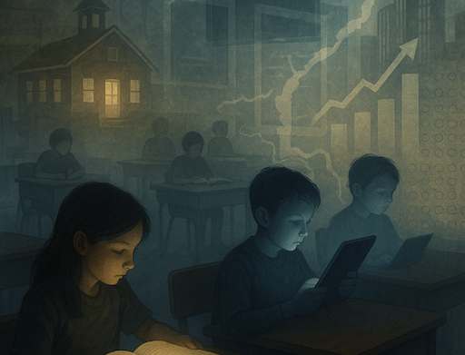

# Teaching America to Read Again

## How Poverty, Policy, and Pixels Shape Who Learns to Read

This project explores how reading is taught—and who gets left behind. From the “balanced literacy” debates of the early 2000s to the recent return of phonics, we look at how methods collide with poverty, screens, and political will. We track the uneven impacts of COVID on children’s literacy, the widening wealth gap, and the federal mandates of No Child Left Behind. We pay close attention to Louisiana and Mississippi, where coordinated policy turned scores around, and to Texas, where rapid growth has meant uneven outcomes.

<iframe src="chart_pct_local_funded.html" width="100%" height="600" style="border:none;"></iframe>

<iframe src="ussd23_by_state.html" width="100%" height="600" style="border:none;"></iframe>

[Colab notebook](https://colab.research.google.com/drive/1pZxP1LmTtmIGfTEV_d9xLhCsKPrJABAc?usp=sharing)

The story begins with children behind their screens during COVID, classrooms dissolving into pixels and parents struggling to teach reading at home. From there, the project unspools the long struggle between “natural” reading methods and structured phonics, showing how policy fads collide with the realities of poverty. It revisits the early 2000s, when No Child Left Behind tried to engineer results with testing and funding incentives, and traces the widening literacy gap across states. Against this backdrop, Louisiana and Mississippi emerge as case studies in reversal: low-performing states that turned literacy outcomes upward through systematic phonics and teacher retraining.
